<div align="center">


# BlackBook MCP v0.6.0
### Source-Grounded Cybersecurity Knowledge & Research MCP

[](#)
[](https://www.python.org/)
[](https://modelcontextprotocol.io/)
[](#available-mcp-tools)
[](#retrieval-architecture)
[](#what-it-is)
[](#testing)
[](#roadmap)
[](LICENSE)
[](#security-model)
[](https://github.com/Daniel-wambua/BlackBook/actions/workflows/ci.yml)

**The read-only cybersecurity knowledge & research teammate: source-grounded search, exact citations, a knowledge graph, and investigation context, running alongside an execution MCP.**

[📖 What It Is](#what-it-is) • [🏗️ Architecture](#architecture-overview) • [🚀 Installation](#installation) • [🛠️ MCP Tools](#available-mcp-tools) • [🕸️ Knowledge Graph](#knowledge-graph) • [🔒 Security](#security-model)

</div>

***

**BlackBook MCP** is a source-grounded cybersecurity **knowledge & research** server
that speaks the Model Context Protocol (MCP). It is the research teammate that runs
*alongside* an execution MCP such as HexStrike inside Claude Code, Cursor, VS Code,
or any MCP-compatible client.

```
                CLAUDE / AI AGENT
                       |
          +------------+------------+
          |                         |
          v                         v
      HEXSTRIKE              BlackBook MCP
      EXECUTION                   KNOWLEDGE
          |                         |
   +------+------+         +--------+--------+
   |      |      |         |        |        |
  Nmap  ffuf  nuclei   HackTricks  0xdf   PDFs
   |      |      |         |        |        |
   +------+------+         +--------+--------+
          |                         |
          +------------+------------+
                       v
                AI REASONING LOOP
```

* **HexStrike** answers: *"what can I execute or test?"*
* **BlackBook** answers: *"what is documented about this situation, which similar
  cases exist, which techniques are relevant, and what source material supports
  that conclusion?"*

Claude is the orchestrator.

> **Read-only by design.** BlackBook never runs commands, scans hosts, or exploits
> targets. It indexes a controlled corpus and retrieves source-grounded knowledge
> with exact, verifiable citations. Execution belongs to a separate MCP.

***

## Architecture Overview

BlackBook MCP v0.6.0 is a source-grounded knowledge system: every query flows through
a hybrid retrieval facade, is enriched (never gated) by a knowledge graph, and returns
results that resolve to exact, verifiable citations. Nothing is executed.

```mermaid
%%{init: {"themeVariables": {
  "primaryColor": "#7f1d1d",
  "secondaryColor": "#dc2626",
  "tertiaryColor": "#ef4444",
  "background": "#1a0505",
  "edgeLabelBackground":"#7f1d1d",
  "fontFamily": "monospace",
  "fontSize": "15px",
  "fontColor": "#fee2e2",
  "nodeTextColor": "#fee2e2"
}}}%%
graph TD
    A[AI Agent - Claude / Cursor / VS Code] -->|MCP Protocol over stdio| B[BlackBook MCP Server v0.6.0]

    B --> C[Hybrid Retrieval Facade]
    B --> D[6 Knowledge Tools]
    B --> E[Knowledge Graph]

    C --> F[FTS5 BM25 - always on]
    C --> G[Local Semantic - optional]
    C --> H[Reranker + Source Diversity]

    D --> I[knowledge_search]
    D --> J[knowledge_source]
    D --> K[knowledge_technique]
    D --> L[knowledge_case_search]
    D --> M[knowledge_research]
    D --> N[knowledge_context]

    E --> O[Technique / Tool / Service / OS]
    E --> P[Writeup / Source entities]
    E --> Q[Evidence-linked edges]

    B --> R[Corpus - SQLite FTS5 + JSON1]
    R --> S[HackTricks]
    R --> T[0xdf Writeups]
    R --> U[Local PDFs]

    B --> V[Exact Citations and Provenance]
    V --> W[chunk_id resolves to verifiable excerpt]

    style A fill:#7f1d1d,stroke:#ef4444,stroke-width:3px,color:#fee2e2
    style B fill:#dc2626,stroke:#7f1d1d,stroke-width:4px,color:#ffffff
    style C fill:#ef4444,stroke:#7f1d1d,stroke-width:2px,color:#1a0505
    style D fill:#ef4444,stroke:#7f1d1d,stroke-width:2px,color:#1a0505
    style E fill:#ef4444,stroke:#7f1d1d,stroke-width:2px,color:#1a0505
    style R fill:#ef4444,stroke:#7f1d1d,stroke-width:2px,color:#1a0505
    style V fill:#ef4444,stroke:#7f1d1d,stroke-width:2px,color:#1a0505
```



### How It Works

1. **AI Agent Connection**: Claude, Cursor, VS Code, or any MCP-compatible client
   connects over stdio. The server owns stdout for the JSON-RPC protocol; every byte
   of banner/log chrome goes to stderr, so the stream is never corrupted.
2. **Source-Grounded Retrieval**: a query flows through metadata filters → FTS5 BM25
   (always available) → optional **local** semantic search → reranking → a
   per-document cap that enforces source diversity.
3. **Graph Enrichment**: the knowledge graph annotates technique dossiers and
   similar-case results with evidence-linked edges. It *enhances* retrieval and never
   gates it: everything works with an empty graph.
4. **Verifiable Provenance**: every result resolves through its `chunk_id` to the
   exact indexed excerpt. BlackBook never fabricates a citation.
5. **Read-Only by Design**: no command execution, host scanning, or arbitrary URL
   fetching through tool parameters. Execution belongs to a separate MCP such as
   HexStrike.

***

## What it is

A **hybrid knowledge system**, not a query→embedding→dump pipeline:

```
query → metadata filter → FTS5 (BM25) → [optional semantic] → rerank →
source diversity → provenance → exact citations
```

Lexical retrieval (SQLite FTS5) is the always-available backbone. Semantic search is
optional and local. Nothing is presented as fact unless it traces to an indexed
source chunk.

## Features (current phase)

* **Source-grounded search** across HackTricks, 0xdf writeups, and local PDFs
* **Exact, verifiable citations**: every reference resolves to real indexed text
* **Structure-preserving chunking**: heading breadcrumbs and code blocks intact
* **Hybrid retrieval facade** with reranking + source diversity: lexical (FTS5
  BM25) always on, **local** semantic embeddings merged in when enabled
* **Local semantic search** (`sentence-transformers`, offline): paraphrased
  queries with no keyword overlap still find the right chunk; degrades gracefully
  to lexical when the extra isn't installed
* **Source filtering & platform/category filters**
* **Knowledge graph** (Technique/Tool/Service/OS/Writeup/Source) built from the
  index; evidence-linked edges enrich technique dossiers and case search without
  ever gating retrieval
* **Modular ingestion** via a `SourceAdapter` interface (add sources without a rewrite)
* **CLI** for ingestion, search, graph, stats, sources, diagnostics
* **MCP server over stdio** for Claude Code / Cursor / VS Code

## Installation

Requires Python ≥ 3.10.

```bash
# with uv (recommended)
uv pip install -e .

# or with pip
pip install -e .

# optional: semantic/embedding search (Phase 3)
uv pip install -e ".[semantic]"

# development / tests
uv pip install -e ".[dev]"
```

This installs two CLI entry points: `blackbook` and `cyber-knowledge` (alias).

## Configuration

BlackBook reads, in increasing priority: built-in defaults → a YAML config file →
`BLACKBOOK_*` environment variables.

```bash
cp config.example.yaml ~/.blackbook/config.yaml
# edit paths/sources; see config.example.yaml for every option
```

Key settings:

```yaml
home: ~/.blackbook                 # data dir (db, caches, raw checkouts)
sources:
  - id: hacktricks
    enabled: true
  - id: "0xdf"                     # quote hex-like ids (YAML parses 0xdf as 223)
    enabled: true
  - id: local_pdfs
    enabled: true
    directory: ~/knowledge/pdfs
    authority: user                # NOT assumed authoritative
embeddings:
  enabled: false                   # set true + install [semantic] for local semantic search
  model: sentence-transformers/all-MiniLM-L6-v2
  device: cpu
retrieval:
  default_limit: 8
  per_document_cap: 2              # source diversity
```

## Initial ingestion

```bash
blackbook ingest --source hacktricks   # markdown book (tarball over HTTPS)
blackbook ingest --source 0xdf         # HTB/CTF writeups
blackbook ingest                        # all enabled sources

# bound the size during a first run:
#   set `max_files: 25` on a source in config.yaml
```

Re-running `ingest` is incremental; unchanged documents are skipped via content
hash.

## PDF ingestion

```bash
# point the local_pdfs source at your directory in config.yaml, then:
blackbook ingest --source local_pdfs
```

PDFs are chunked per page with page-number citations. They default to
`authority: user` and are **not** treated as authoritative.

## Searching

```bash
blackbook search "kerberoasting"
blackbook search "windows service privilege escalation" --source hacktricks
blackbook search "NTLM relay" --platform windows --limit 5
blackbook search "crack service account passwords" --mode semantic  # paraphrase-friendly
blackbook stats [--json]        # corpus counts (machine-readable with --json)
blackbook sources [--json]
blackbook graph build     # (re)build the knowledge graph from the index
blackbook graph show [--json]   # graph entity/relationship counts
blackbook doctor          # diagnostics: db, index, sources, embeddings
blackbook rebuild-index   # rebuild the FTS5 index
blackbook case export MY-CASE   # export an investigation case as Markdown
blackbook backup          # snapshot the knowledge base (VACUUM INTO)
```

`platform` and `categories` are **hard filters**: results only come from
documents carrying the tag (e.g. `windows`/`linux`, `htb`, `Easy`/`Insane`).
The MCP tools' `techniques` parameter resolves through the controlled
vocabulary and biases results toward chunks whose heading names the technique;
unknown terms are searched as plain keywords and flagged in the response note.

Search modes: `hybrid` (default, lexical + semantic), `keyword` (FTS5 only),
`semantic` (embeddings only), plus two intent-biased modes: `technique` (nudges
canonical technique/reference material up) and `case_similarity` (favours hands-on
writeups). The intent modes *nudge* ranking, they never filter results out. Semantic
and hybrid use vectors only when `embeddings.enabled` and the `[semantic]` extra is
installed; otherwise they fall back to lexical automatically.

### Semantic embeddings

With `embeddings.enabled: true` and the `[semantic]` extra, ingestion embeds new
chunks inline. To (re)build the semantic index without re-ingesting:

```bash
blackbook embed                       # embed chunks missing a current-model vector
blackbook embed --source local_pdfs   # only one source
blackbook embed --reembed             # drop existing vectors first, then re-embed
```

Embeddings are computed **locally** and never leave the machine. `blackbook doctor`
reports coverage (`N/M embedded`).

## Claude Code setup

```bash
claude mcp add blackbook -- blackbook serve
```

or in your MCP config (`.mcp.json` / `~/.config/claude/...`):

```json
{
  "mcpServers": {
    "blackbook": { "command": "blackbook", "args": ["serve"] }
  }
}
```

Using a virtualenv? Point `command` at it: `"/home/you/venv/bin/blackbook"`.

## Cursor

`Settings → MCP → Add server`:

```json
{ "mcpServers": { "blackbook": { "command": "blackbook", "args": ["serve"] } } }
```

## VS Code

`.vscode/mcp.json` (with an MCP-capable extension):

```json
{ "servers": { "blackbook": { "command": "blackbook", "args": ["serve"] } } }
```

## Startup banner

Launching the server prints a banner and then streams status logs. Every byte of
this chrome goes to **stderr**; stdout is reserved for the JSON-RPC protocol, so
the banner and logs never corrupt an MCP client's stream.

```
██████╗ ██╗      █████╗  ██████╗██╗  ██╗██████╗  ██████╗  ██████╗ ██╗  ██╗
██╔══██╗██║     ██╔══██╗██╔════╝██║ ██╔╝██╔══██╗██╔═══██╗██╔═══██╗██║ ██╔╝
██████╔╝██║     ███████║██║     █████╔╝ ██████╔╝██║   ██║██║   ██║█████╔╝ 
██╔══██╗██║     ██╔══██║██║     ██╔═██╗ ██╔══██╗██║   ██║██║   ██║██╔═██╗ 
██████╔╝███████╗██║  ██║╚██████╗██║  ██╗██████╔╝╚██████╔╝╚██████╔╝██║  ██╗
╚═════╝ ╚══════╝╚═╝  ╚═╝ ╚═════╝╚═╝  ╚═╝╚═════╝  ╚═════╝  ╚═════╝ ╚═╝  ╚═╝
  Source-grounded cybersecurity knowledge & research MCP
  v0.6.0  ·  stdio  ·  read-only · no execution · every claim cited
  corpus  3 sources · 1204 docs · 18630 chunks · 18630 embeddings
  graph   642 entities · 1508 relationships · 2 cases
```

In a real terminal the wordmark is gradient-lit (cyan→indigo, intentionally
distinct from an execution MCP's red) and the corpus/graph lines reflect your
live index. Suppress it with `blackbook serve --no-banner`.

Status and log lines use a compact, level-styled prefix, showing the successes and
failures at a glance:

```
[+] Embedded 18630 chunks. Total vectors: 18630     success  (green)
[*] server ready                                    info     (cyan)
[!] Graph rebuild skipped: no chunks changed        warning  (yellow)
[-] hacktricks: fetch failed (offline)              error    (red)
```

Rich strips the colour automatically when output is piped or redirected, so log
files stay clean.

## Available MCP tools

| Tool | Status | Purpose |
|------|--------|---------|
| `knowledge_search` | ✅ | Source-grounded search with provenance-tagged results |
| `knowledge_source` | ✅ | Resolve a reference to the exact supporting excerpt |
| `knowledge_technique` | ✅ | Structured technique dossier (graph-enriched, always cited) |
| `knowledge_case_search` | ✅ | Similar-case (writeup) retrieval, techniques annotated |
| `knowledge_research` | ✅ | Observation-driven, source-grounded research packets |
| `knowledge_context` | ✅ | Local investigation state (cases + observations) |

Only implemented tools are registered; nothing is stubbed or faked.

### Example Claude Code interaction

```
You:    What does HackTricks document about Kerberoasting, and has 0xdf
        covered a similar HTB machine?

Claude: (calls knowledge_search {query: "kerberoasting", sources: ["hacktricks","0xdf"]})
        HackTricks documents Kerberoasting under Active Directory → Kerberos …
        Similar 0xdf case: HTB: Forest …
        [cites chunk refs]

Claude: (calls knowledge_source {chunk_id: …} to read the exact section)
        Here's the exact HackTricks enumeration procedure …
```

## Knowledge graph

A lightweight graph of `Technique / Tool / Service / OS / Writeup / Source`
entities and their relationships (`documented_by`, `demonstrated_in`, `uses`,
`targets`, `runs_on`, …), derived **from the already-indexed corpus**, with no fetching
or execution. Every non-structural edge carries the document it was extracted from
(`evidence_doc_id`), a `confidence`, and an `inferred` flag; nothing is fabricated,
and a citation always resolves to real indexed text.

The graph **enhances** retrieval, it never gates it: search and both new tools work
with an empty graph and simply gain neighbours/annotations once it is built.

```bash
blackbook graph build     # (re)build the graph from the index, full and idempotent
blackbook graph show      # current entity/relationship counts, no rebuild
```

Ingesting also refreshes the graph automatically (skip with `ingest --no-graph`).
Two tools consume it:

* `knowledge_technique`: returns which sources document a technique, which
  tools/services/writeups the graph associates with it (each edge with confidence
  and its backing document), plus real cited excerpts. Works before the graph
  exists; it always returns indexed references.
* `knowledge_case_search`: finds hands-on writeups similar to a situation and,
  when the graph is built, annotates each with the techniques it demonstrates.

## Retrieval architecture

See `docs/retrieval.md`. FTS5 BM25 is always available; semantic search is an
optional local backend merged into the same facade. Reranking combines lexical
score, source authority, platform/category match, and keyword overlap, then a
per-document cap enforces source diversity.

## Source provenance

Every claim carries provenance. `knowledge_search` returns a `ref` (chunk_id,
doc_id, source, url, page, section_path); `knowledge_source` resolves it to the
exact indexed text. BlackBook never fabricates a citation.

## Troubleshooting

```bash
blackbook doctor --verbose     # full diagnostics
```

* **`Unknown or disabled source`**: check `blackbook sources`; quote `"0xdf"` in YAML.
* **Empty results**: run `blackbook ingest` first; check `blackbook stats`.
* **PDF dir missing**: set `sources[].directory` for `local_pdfs`.
* **Logs**: add `--verbose` to any command for structured debug output.

## Security model

BlackBook is read-only with respect to external systems, confines filesystem reads
to configured knowledge directories, validates all tool inputs, and never fetches
arbitrary URLs through tool parameters. See `docs/security.md`.

## Development

```bash
uv pip install -e ".[dev]"
python -m pytest tests          # run the suite
```

Layout:

```
src/blackbook/
  config.py            layered settings
  server.py            FastMCP wiring (stdio)
  mcp/                 tool schemas + implementations
  ingestion/           SourceAdapter + per-source adapters + pipeline
  retrieval/           lexical / hybrid / reranker / chunking
  knowledge/           source resolution (citation -> excerpt)
  storage/             SQLite (FTS5 + JSON1), models, migrations
  cli/                 Typer CLI
  utils/               path-safety helpers
tests/                 unit + fixtures (+ integration)
docs/                  architecture, ingestion, retrieval, mcp, security
```

## Testing

```bash
python -m pytest tests -q
```

Tests cover chunking, storage/FTS5 sync, HackTricks & 0xdf parsing (offline
fixtures), retrieval & reranking, semantic embeddings & hybrid merge, MCP tools,
provenance round-trips, and path safety. Semantic tests use a deterministic
model-free embedder so they run offline with no model download; one real-model
test skips cleanly when the `[semantic]` extra isn't installed. PDF tests use a
generated PDF and skip if `reportlab` isn't installed.

## Roadmap

- [x] **Phase 1**: MCP server, SQLite+FTS5, HackTricks + 0xdf ingestion, search, citations
- [x] **Phase 2**: font-aware PDF adapter (heading/code detection, page-level
  citations), cross-document near-duplicate detection, structural chunking, CLI
- [x] **Phase 3**: local embeddings (`all-MiniLM-L6-v2`), hybrid retrieval, reranking
- [x] **Phase 4**: knowledge graph, technique relationships, case similarity
- [x] **Phase 5**: `knowledge_research` (observation → source-grounded packet),
  `knowledge_context` (local investigation state)
- [x] **Phase 6**: offline evaluation suite (`blackbook eval`), citation-integrity
  gate, FTS5 optimize on ingest, adversarial/hardening tests

## License

MIT. See `LICENSE`.
